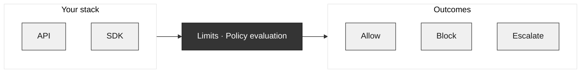

Limits intercepts every agentic action at the edge, centralizes and versions stateful policies, and replaces prompt-driven constraints with deterministic rules.

<CardGroup cols={2}>
  <Card title="Overview" icon="compass" href="/quickstart">
    How Limits works: policies, allow/block/escalate, and your stack.
  </Card>
  <Card title="Instructions vs Conditions" icon="lightbulb" href="/policies/instructions-vs-conditions">
    Two ways to define a policy: structured conditions or natural-language instructions.
  </Card>
  <Card title="Quickstart" icon="rocket" href="/quickstart">
    Get up and running in under 5 minutes.
  </Card>
  <Card title="Platform Guide" icon="layout" href="/platform/getting-started">
    Learn how to use the Limits platform.
  </Card>
  <Card title="SDK Reference" icon="code" href="/sdk/installation">
    Explore the SDK and start defining policies.
  </Card>
  <Card title="LangChain integration" icon="plug" href="/sdk/langchain">
    Integrate with LangChain agents via custom middleware.
  </Card>
</CardGroup>

## Key Features

<CardGroup cols={2}>
  <Card title="Deterministic Policies" icon="shield-check">
    Define rules that always execute the same way—no prompt ambiguity.
  </Card>
  <Card title="Human Approval Workflows" icon="user-check">
    Require review (escalation) for sensitive agent actions.
  </Card>
  <Card title="Audit Logs" icon="scroll">
    Full visibility into every policy check and agent decision.
  </Card>
  <Card title="Edge Interception" icon="bolt">
    Sub-millisecond policy evaluation at the edge.
  </Card>
</CardGroup>
## Why Limits?

Building with AI and agents introduces risks that are hard to manage with code alone:

- **Agents and LLMs can take actions** that shouldn't be allowed—spend, data access, or out-of-scope operations—without a central place to enforce rules.
- **Hard-coding rules in application code** is brittle, doesn't scale across teams or products, and mixes business policy with implementation.
- **Manual review doesn't scale**; you need consistent, automated policy enforcement with the option to escalate when it matters.
- **Visibility is missing**: what was allowed, what was blocked, what needed approval, and why.
- **API, SDK, and backend services** need the same policy layer so behavior is consistent everywhere.

Limits gives you one policy layer: define rules once, enforce them across your stack, and keep full visibility and control.

## How it works

Requests from your stack (API, SDK, agents, webhooks, scheduled jobs, or manual triggers) hit the Limits policy layer. Limits evaluates each request against your policies and returns **allow**, **block**, or **escalate**—so the same rules apply everywhere.

### Platform journey

1. **Define a policy** — In the Dashboard, open the **Assistant** (top right), choose the policy mode (Conditions, Instructions, or Guardrails), and describe what you want in natural language. The Assistant generates the policy.
2. **View and refine** — You’re taken to the results area; the UI adapts to the policy mode. Edit via the Assistant or manually in the visual editor.
3. **Test** — Generate test cases and simulate requests (by single policy or by tag). Simulation works for any policy; it’s for testing before you use the policy in your app.
4. **Engine** — Every evaluation is run by the Limits engine and returns **allow**, **block**, or **escalate** (priority: Block > Escalate > Allow).
5. **Use in your app** — When the policy is ready, call the **SDK** (`check()`, `evaluate()`, `guard()`). The SDK only enforces **active** policies; inactive ones are skipped. Handle the result in your code (`data.action`, `isAllowed`, `isBlocked`, `isEscalated`, `data.reason`)—see [SDK Policies](/sdk/policies#result-shape).
6. **Observe** — All evaluations are **logged**. Escalated requests go to **Approvals**, where you approve or decline. You can configure **notifications** (allow/block/escalate) and, for escalations, **on_approve** and **on_decline** webhooks.

### You define policies, not just code

Policies live in the Limits platform. You describe **when** to allow, block, or escalate using **conditions** (e.g. request amount, user risk, resource type), and optionally **instructions** that guide the system. You can start from natural language in the **Assistant** ("Block requests over $10,000" or "Escalate when risk is high"), then refine in the visual editor—no need to hand-write policy logic in every service.

Policies are evaluated for every request; the outcome is **allow**, **block**, or **escalate**.

### Three outcomes: Allow, Block, Escalate

Every request is evaluated against your policies:

| Outcome | Meaning |
| -------- | ------- |
| **Allow** | The request is permitted. |
| **Block** | The request is denied. |
| **Escalate** | The request is escalated; you decide in the **Approvals** queue. |

**Priority:** Block overrides Escalate, Escalate overrides Allow. You define conditions in the visual condition builder.

### One policy layer across your stack

Use the same policies everywhere. Create **API keys** in Limits, then call the Limits API or SDK from your app or backend—one source of truth and consistent behavior across your stack.

### You stay in control- **Dashboard** — Active policies, pending approvals, and counts of approved/blocked requests.
- **Policies** — Create and edit policies (conditions and instructions); use the Assistant to generate from natural language and simulate before deploying.
- **Logs** — Filter and search action logs for full auditability.
- **Approvals** — Handle escalated requests in one place.

<Info>
**Where to find everything:** See the [Platform Guide](/platform/getting-started) for navigation, routes, and where to find Dashboard, Policies, Logs, Approvals, and API Keys.
</Info>

## Policies do what you tell them

You control the logic: simple rules, conditional workflows, or complex multi-step behavior.

**Simple rule:**

- Block any request where `request.amount > 10000`.
- Allow all other requests.

**Conditional workflow:**

- If `user.risk_level == 'high'`: escalate.
- If `request.amount > 5000`: escalate.
- Otherwise: allow.You define the conditions and instructions; Limits evaluates every request and returns allow, block, or escalate—and logs it all.

## Next steps

<CardGroup cols={2}>
  <Card title="Instructions vs Conditions" icon="lightbulb" href="/policies/instructions-vs-conditions">
    When to use Conditions mode vs Instructions mode for policies.
  </Card>
  <Card title="Quickstart" icon="rocket" href="/quickstart">
    Get up and running in under 5 minutes.
  </Card>
  <Card title="Platform Guide" icon="layout" href="/platform/getting-started">
    Dashboard, Policies, Logs, Approvals, API Keys.
  </Card>
  <Card title="SDK Reference" icon="code" href="/sdk/installation">
    Integrate policies in your app with the SDK.
  </Card>
  <Card title="API Reference" icon="square-terminal" href="/api-reference/introduction">
    Call the API directly for policy evaluation and approvals.
  </Card>
</CardGroup>
