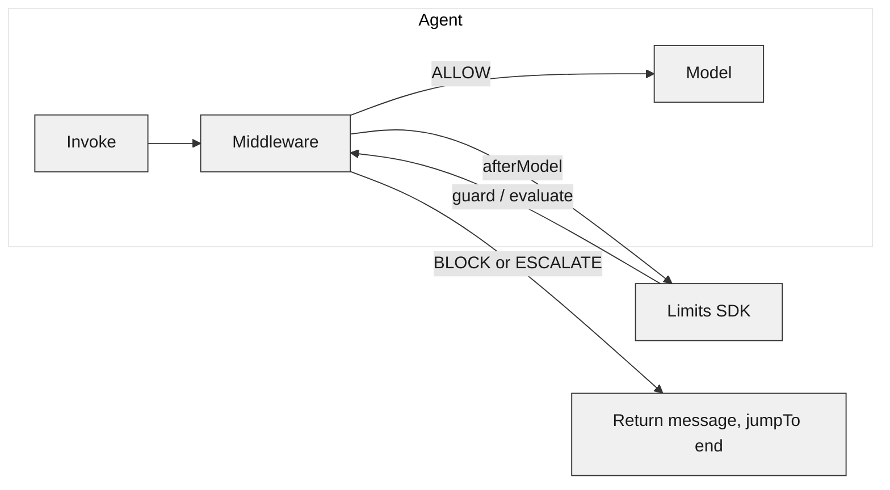

Use the Limits SDK with **LangChain** by adding custom middleware to your agent. The middleware runs at specific points in the agent lifecycle and calls Limits for **guardrails**, **instructions**, and **conditions**. You need only `@limits/js` and `langchain`—no extra package.

You can run **guardrails** and **instructions** on every model response (`afterModel`) and **conditions** before the model or agent (`beforeModel` / `beforeAgent`). On block or escalate, the middleware can return a replacement message and exit early.

<Card title="SDK Policies" icon="shield" href="/sdk/policies">
  Result shape and <code>check()</code>, <code>evaluate()</code>, <code>guard()</code>.
</Card>

---

## Prerequisites

| Requirement | Version |
|-------------|---------|
| Node.js     | `>= 18.0.0` |
| `@limits/js` | Latest   |
| `langchain`  | Compatible with [custom middleware](https://docs.langchain.com/oss/javascript/langchain/middleware/custom) |
| Limits API key | From [Dashboard → API keys](/platform/api-keys) |

---

## How it works

LangChain agents support **custom middleware** with hooks such as `beforeModel`, `afterModel`, and `beforeAgent`. Your middleware receives the current state (including `messages`) and can call the Limits SDK. Depending on the result (allow, block, escalate), you continue normally or return a replacement message and jump to the end of execution.



---

## Installation

Install the Limits SDK and LangChain:

<CodeGroup>
```bash npm
npm install @limits/js langchain
```

```bash yarn
yarn add @limits/js langchain
```

```bash pnpm
pnpm add @limits/js langchain
```
</CodeGroup>

---

## Step-by-step

1. **Create a Limits client** — `new Limits({ apiKey })`. Reuse it for all middleware calls.
2. **Create middleware** — Use `createMiddleware` from `langchain` with an `afterModel` hook (and optionally `beforeModel` for conditions).
3. **In `afterModel`** — Get the last human and AI messages from `state.messages`. Use `lastHuman.content` and `lastAI.content` as the prompt and response strings. Call `limits.guard(...)` and/or `limits.evaluate(...)`. On BLOCK or ESCALATE, return `{ messages: [new AIMessage(reason)], jumpTo: "end" }`.
4. **Register middleware** — Pass your middleware in `createAgent({ ..., middleware: [limitsMiddleware] })`.
5. **Invoke the agent** — Use `agent.invoke({ messages: [...] })` as usual. Policy runs automatically on each turn.

---

## Full example: guardrails and instructions

This example runs **guardrails** and **instructions** after each model response. If Limits blocks or escalates, the middleware returns a single AI message and jumps to the end.

```typescript
import { createMiddleware, createAgent, AIMessage, HumanMessage } from "langchain";
import { Limits } from "@limits/js";

const limits = new Limits({ apiKey: process.env.LIMITS_API_KEY! });

const limitsMiddleware = createMiddleware({
  name: "LimitsGuardrails",
  afterModel: {
    canJumpTo: ["end"],
    hook: async (state) => {
      const messages = state.messages ?? [];
      const lastHuman = [...messages].reverse().find((m) => m._getType?.() === "human");
      const lastAI = messages[messages.length - 1];
      const prompt = lastHuman?.content ?? "";
      const response = lastAI?.content ?? "";

      const guardResult = await limits.guard("#safety", response);
      if (guardResult.isBlocked) {
        return {
          messages: [new AIMessage(guardResult.data.reason)],
          jumpTo: "end",
        };
      }
      if (guardResult.isEscalated) {
        return {
          messages: [new AIMessage(`Under review: ${guardResult.data.reason}`)],
          jumpTo: "end",
        };
      }

      const evalResult = await limits.evaluate("#instructions", prompt, response);
      if (evalResult.isBlocked) {
        return {
          messages: [new AIMessage(evalResult.data.reason)],
          jumpTo: "end",
        };
      }
      if (evalResult.isEscalated) {
        return {
          messages: [new AIMessage(`Needs review: ${evalResult.data.reason}`)],
          jumpTo: "end",
        };
      }
      return;
    },
  },
});

const agent = createAgent({
  model: "gpt-4.1",
  tools: [],
  middleware: [limitsMiddleware],
});

const result = await agent.invoke({
  messages: [new HumanMessage("Explain refund policy for order #123")],
});
```

Replace `#safety` and `#instructions` with your policy keys or tags. The result shape is the same as other SDK methods—see [Result shape](/sdk/policies#result-shape) and [Errors](/sdk/reference#errors).

---

## Optional: conditions with `beforeModel`

To evaluate **conditions** before each model call (e.g. user or context checks), add a `beforeModel` hook. Build an input from `state` (and optionally `runtime.context`), call `limits.check(policyKeyOrTag, input)`, and on BLOCK or ESCALATE return `jumpTo: "end"` with an optional message.

```typescript
const limitsMiddleware = createMiddleware({
  name: "LimitsConditions",
  beforeModel: {
    canJumpTo: ["end"],
    hook: async (state, runtime) => {
      const input = {
        userId: runtime?.context?.userId,
        messageCount: state.messages?.length ?? 0,
      };
      const result = await limits.check("#payments", input);
      if (result.isBlocked) {
        return {
          messages: [new AIMessage(result.data.reason)],
          jumpTo: "end",
        };
      }
      if (result.isEscalated) {
        return {
          messages: [new AIMessage(`Escalated: ${result.data.reason}`)],
          jumpTo: "end",
        };
      }
      return;
    },
  },
});
```

---

## Result handling

| Limits result | Middleware action |
|---------------|-------------------|
| **ALLOW**     | Return nothing; execution continues to the model or next step. |
| **BLOCK**     | Return `{ messages: [new AIMessage(reason)], jumpTo: "end" }` (or your chosen message). |
| **ESCALATE**  | Same as block, or return a "pending review" message and `jumpTo: "end"`. |

For full result shape (`data.action`, `data.reason`, `isAllowed`, `isBlocked`, `isEscalated`), see [Policies: Result shape](/sdk/policies#result-shape).

---

## Next steps

<CardGroup cols={2}>
  <Card title="Policies" icon="shield" href="/sdk/policies">
    <code>check()</code>, <code>evaluate()</code>, <code>guard()</code>, and result shape.
  </Card>
  <Card title="Guardrails" icon="shield" href="/sdk/guardrails">
    Use <code>guard()</code> for safety, PII, moderation.
  </Card>
  <Card title="SDK Reference" icon="code" href="/sdk/reference">
    Types, errors, and API summary.
  </Card>
  <Card title="LangChain: Custom middleware" icon="plug" href="https://docs.langchain.com/oss/javascript/langchain/middleware/custom">
    Hooks, execution order, and state.
  </Card>
</CardGroup>
